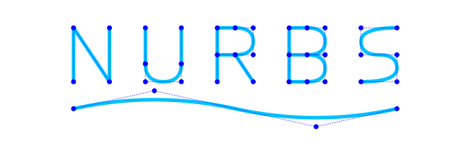

[![Documentation Status][docs-img]][docs-url]
[![Build Status][build-img]][build-url]
[![Lint with Black][lintblack-img]][lintblack-url]
[![Code Coverage][coverage-img]][coverage-url]

[![PyPI Version][pypi-img]][pypi-url]
[![Python Versions][pyversions-img]][pyversions-url]
[![License: MIT][license-img]][license-url]



A pure object-oriented python package for parametrized geometry which supports [Custom objects](https://pynurbs.readthedocs.io/en/latest/rst/custom_objects.html).


## Features

* [X] Evaluate points
* [X] Insert and remove knots
* [X] Degree increase and decrease
* [X] Split and unite curves
* [X] Math operations (``+``, ``-``, ``*``, ``/``, ``@``)
* [X] Projection of point in curve
* [X] Intersection of two curves
* [X] Derivative of curves
* [X] Line Integral
* [X] Curve fitting
* [X] Function fitting
* [X] Points fitting
* [ ] Reparameterize curve

## Install

This library is available in [PyPI][pypi-url]. To install it

```
pip install pynurbs
```

For more details, refer to the [documentation][docs-url].

## Documentation

The documentation can be found at [pynurbs.readthedocs.io][docs-url]


## Contribute

Please use the [Issues][issues-url] or refer to the email ```compmecgit@gmail.com```

<!-- Badges: -->

<!-- Badges: -->

[nurbswiki-url]: https://pt.wikipedia.org/wiki/NURBS
[lintblack-img]: https://github.com/compmec/pynurbs/actions/workflows/black.yaml/badge.svg
[lintblack-url]: https://github.com/compmec/pynurbs/actions/workflows/black.yaml
[docs-img]: https://readthedocs.org/projects/pynurbs/badge/?version=latest
[docs-url]: https://pynurbs.readthedocs.io/en/latest/?badge=latest
[pypi-img]: https://img.shields.io/pypi/v/pynurbs
[pypi-url]: https://pypi.org/project/pynurbs/
[build-img]: https://github.com/compmec/pynurbs/actions/workflows/build.yaml/badge.svg
[build-url]: https://github.com/compmec/pynurbs/actions/workflows/build.yaml
[coverage-img]: https://codecov.io/gh/compmec/pynurbs/branch/main/graph/badge.svg?token=vfGMPe9W3I
[coverage-url]: https://codecov.io/gh/compmec/pynurbs
[pyversions-img]: https://img.shields.io/pypi/pyversions/pynurbs.svg?style=flat-square
[pyversions-url]: https://pypi.org/project/pynurbs/
[license-img]: https://img.shields.io/pypi/l/ansicolortags.svg
[license-url]: https://github.com/compmec/pynurbs/blob/main/LICENSE.md
[pypi-url]: https://pypi.org/project/pynurbs/
[issues-url]: https://github.com/compmec/pynurbs/issues
