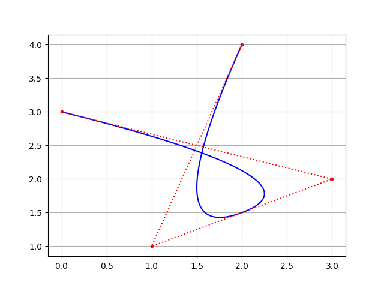
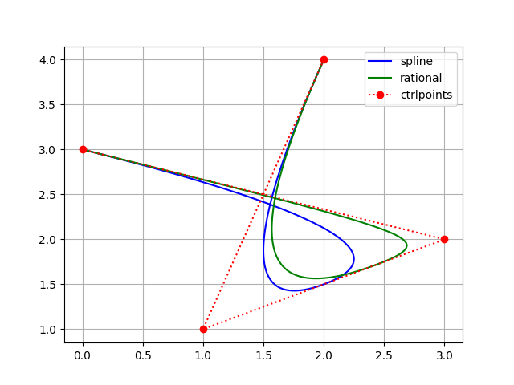
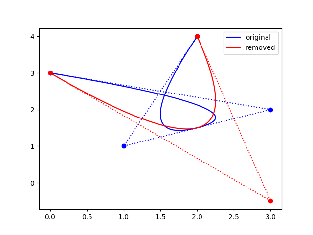
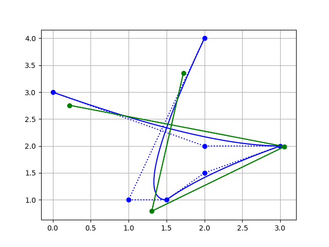
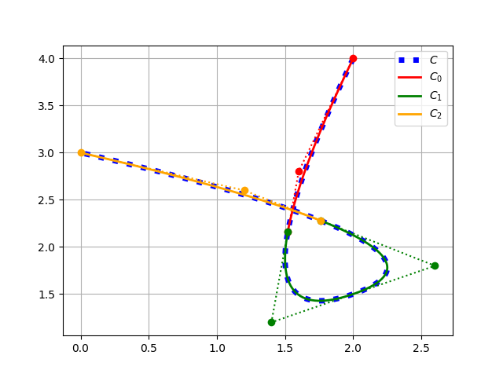
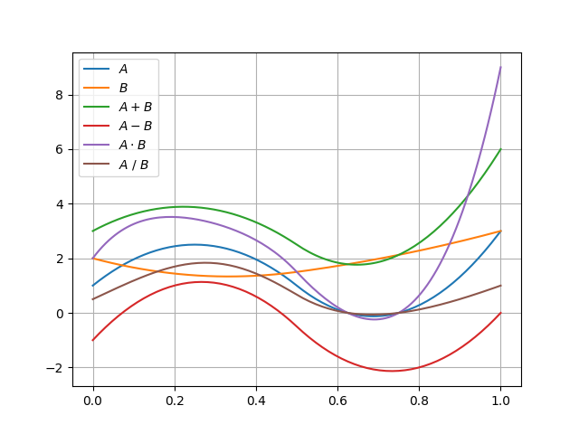
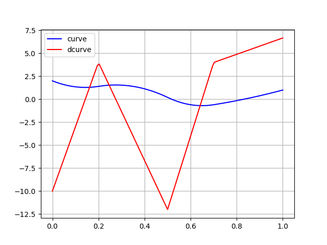
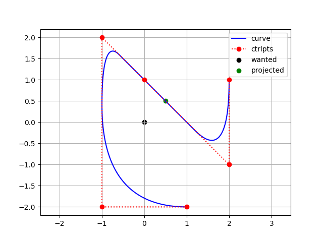
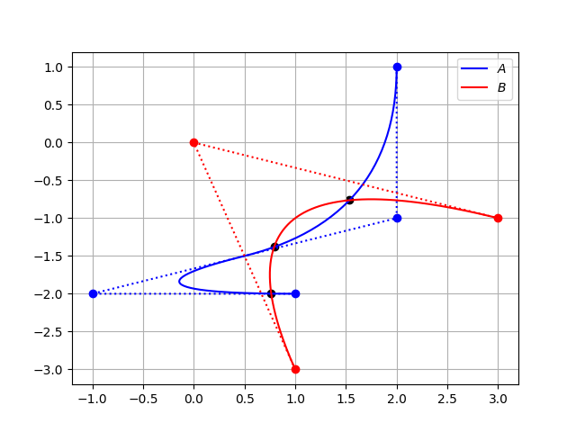

.. _basics:

======
Basics
======

This page is meant as a fast guide for these who already know about NURBS.

If you don't feel confident, please go to :ref:`tutorial`

--------------------------------------------------------------------------

Construct a BSpline curve
-------------------------

To define a curve, you need:

* one ``knotvector``, which tells the ``degree`` and ``npts``  of the curve
* number of points (``npts``) control points

You can use the **GeneratorKnotVector** to help you create the ``knotvector``.

As direct example, we present a simple code to plot a spline curve

.. code-block:: python

    import numpy as np
    from pynurbs import GeneratorKnotVector, Curve
    
    # Define the knotvector (0, 0, 0, 0.5, 1, 1, 1)
    knotvector = GeneratorKnotVector.uniform(degree = 2, npts = 4)

    # Create curve instance
    curve = Curve(knotvector)

    # Create the control points
    ctrlpoints = [(2, 4), (1, 1), (3, 2), (0, 3)]
    
    # Set curve's control points
    curve.ctrlpoints = np.array(ctrlpoints)

.. warning::
    The control points must support the linear operations:
    
    * sum of two points: ``point0 + point1``
    * multiplication by an scalar: ``scalar * point``

    As example, ``(2, 4)`` is a tuple hence ``1.5 * (2, 4)`` is not valid and raises ``TypeError``.
    
    In the code above we converted the points to ``numpy.array`` to allow such operations.

.. _evaluate-points:

Evaluating curve points
-----------------------

To evaluate the curve points, you can call the curve as a function or use the ``eval`` function.

Use ``curve(nodes)`` is the same as ``curve.eval(nodes)``

.. code-block:: python

    import numpy as np
    from matplotlib import pyplot as plt
    from pynurbs import GeneratorKnotVector, Curve
    
    # Create the curve
    knotvector = GeneratorKnotVector.uniform(2, 4)
    ctrlpoints = np.array([(2, 4), (1, 1), (3, 2), (0, 3)])
    curve = Curve(knotvector, ctrlpoints)

    # Evaluate points to plot curve
    uplot = np.linspace(0, 1, 129)
    points = curve(uplot)  # Shape (129, 2)

    # Plot the points
    xplot = [point[0] for point in points]
    yplot = [point[1] for point in points]
    plt.plot(xplot, yplot, color="b")
    
    # Mark the control points
    xvertices = [point[0] for point in curve.ctrlpoints]
    yvertices = [point[1] for point in curve.ctrlpoints]
    plt.plot(xvertices, yvertices, marker=".", ls="dotted", color="r")
    
    # Add grid and show image
    plt.grid()
    plt.show()

Construct a rational bspline curve
----------------------------------

The steps to construct a **rational bspline curve** is the same as to construct a **bspline curve**, but we set the attribute ``weights`` 

.. code-block:: python

    import numpy as np
    from matplotlib import pyplot as plt
    from pynurbs import GeneratorKnotVector, Curve
    
    knotvector = GeneratorKnotVector.uniform(2, 4)
    ctrlpoints = np.array([(2, 4), (1, 1), (3, 2), (0, 3)])
    curve = Curve(knotvector, ctrlpoints)

    # From spline to rational bspline
    curve.weights = [1, 2, 5, 1]

.. _insert-remove-knots:

Insert and remove knots
-----------------------

Two of the main features are ``knot_insert`` and ``knot_remove``, which don't modify the curve

.. code-block:: python

    import numpy as np
    from pynurbs import GeneratorKnotVector, Curve

    knotvector = GeneratorKnotVector.uniform(2, 4)
    ctrlpoints = np.array([(2, 4), (1, 1), (3, 2), (0, 3)])
    curve = Curve(knotvector, ctrlpoints)

    print(curve.knotvector)  # (0.0, 0.0, 0.0, 0.5, 1.0, 1.0, 1.0)
    curve.knot_insert([0.2, 0.2, 0.5, 0.7])
    print(curve.knotvector)  # (0.0, 0.0, 0.0, 0.2, 0.2, 0.5, 0.5, 0.7, 1.0, 1.0, 1.0)
    curve.knot_remove([0.2, 0.5, 0.7])
    print(curve.knotvector)  # (0.0, 0.0, 0.0, 0.2, 0.5, 1.0, 1.0, 1.0)

Trying to remove non-possible knots raises a ``ValueError``

.. code-block:: python

    import numpy as np
    from pynurbs import GeneratorKnotVector, Curve

    knotvector = GeneratorKnotVector.uniform(2, 4)
    ctrlpoints = np.array([(2, 4), (1, 1), (3, 2), (0, 3)])
    curve = Curve(knotvector, ctrlpoints)

    print(curve.knotvector)  # (0.0, 0.0, 0.0, 0.5, 1.0, 1.0, 1.0)
    curve.knot_remove([0.5])
    # ValueError: Cannot update knotvector cause error is  6.00e-01 > 1e-09

It's possible to force knot removal by changing the value of ``tolerance`` or setting it to ``None`` (infinite tolerance)

.. code-block:: python

    import numpy as np
    from pynurbs import GeneratorKnotVector, Curve

    knotvector = GeneratorKnotVector.uniform(2, 4)
    ctrlpoints = np.array([(2, 4), (1, 1), (3, 2), (0, 3)])
    curve = Curve(knotvector, ctrlpoints)

    print(curve.knotvector)  # (0.0, 0.0, 0.0, 0.5, 1.0, 1.0, 1.0)
    curve.knot_remove([0.5], tolerance = None)

.. _degree-increase-decrease:

Degree increase and decrease
----------------------------

Other two of the main features are ``degree_increase`` and ``degree_decrease`` which modifies the polynomial degree without changing the curve

.. code-block:: python

    import numpy as np
    from pynurbs import GeneratorKnotVector, Curve

    knotvector = GeneratorKnotVector.uniform(2, 4)
    ctrlpoints = np.array([(2, 4), (1, 1), (3, 2), (0, 3)])
    curve = Curve(knotvector, ctrlpoints)

    print(curve.degree)  # 2
    curve.degree_increase()
    print(curve.degree)  # 3
    curve.degree_decrease()
    print(curve.degree)  # 2

Trying to decrease a non-possible degree raises a ``ValueError`` for given ``tolerance``.
You can also change the value of ``tolerance`` or set it to ``None`` (infinite tolerance)

.. code-block:: python

    import numpy as np
    from pynurbs import GeneratorKnotVector, Curve

    knotvector = [0, 0, 0, 0, 1/3, 1/3, 1/3, 2/3, 2/3, 2/3, 1, 1, 1, 1]
    ctrlpoints = [(1, 0), (1, 1), (0, 1), (-1, 1), (-1, 0),
                (-1, -1), (0, -1), (1, -1), (0.5, -0.5), (1, 0)]
    curve = Curve(knotvector, np.array(ctrlpoints))  # Blue
    
    curve.degree_decrease(times = 1)
    # ValueError: Cannot update knotvector cause error is  1.04e-02 > 1e-09

    curve.degree_decrease(times = 1, tolerance = None)  # Red
    
    curve.degree_decrease(times = 1, tolerance = None)  # Green

Clean curve
-----------------------

It's possible to use ``knot_clean``, ``degree_clean`` and ``clean`` to reduce to minimum the number of control points of the curve.

It's usefull when there are unecessary knots caused by **knot insertion** or **degree increase**.

.. code-block:: python

    import numpy as np
    from pynurbs import GeneratorKnotVector, Curve

    knotvector = GeneratorKnotVector.uniform(2, 4)
    ctrlpoints = np.array([(2, 4), (1, 1), (3, 2), (0, 3)])
    curve = Curve(knotvector, ctrlpoints)

    curve.degree_increase(2)
    print(curve.degree)  # 4
    curve.degree_clean()
    print(curve.degree)  # 2

    curve.knot_insert([0.25, 0.75])
    print(curve.knotvector)  # (0.0, 0.0, 0.0, 0.25, 0.5, 0.75, 1.0, 1.0, 1.0)
    curve.knot_clean()
    print(curve.knotvector)  # (0.0, 0.0, 0.0, 0.5, 1.0, 1.0, 1.0)

.. _split-unite:

Split and unite
-----------------------

It's possible to ``split`` and unite curves.

.. code-block:: python

    import numpy as np
    from pynurbs import GeneratorKnotVector, Curve

    knotvector = GeneratorKnotVector.uniform(2, 4)
    ctrlpoints = np.array([(2, 4), (1, 1), (3, 2), (0, 3)])
    curve = Curve(knotvector, ctrlpoints)

    subcurves = curve.split([0.2, 0.8])
    print(len(subcurves))  # 3
    print(subcurves[0].knotvector)  # (0.0, 0.0, 0.0, 0.2, 0.2, 0.2)
    print(subcurves[1].knotvector)  # (0.2, 0.2, 0.2, 0.5, 0.8, 0.8, 0.8)
    print(subcurves[2].knotvector)  # (0.8, 0.8, 0.8, 1.0, 1.0, 1.0)

    original_curve = subcurves[0] | subcurves[1] | subcurves[2]
    print(original_curve.knotvector)  # (0.0, 0.0, 0.0, 0.5, 1.0, 1.0, 1.0)

.. note::
    Unite curves ``A`` and ``B`` requires that ``max(A.knotvector) = min(B.knotvector)``

    The operation ``A | B`` calls ``knot_clean`` for the knot ``max(A.knotvector)``

.. _math-operations:

Mathematic operations
-----------------------

The ``Curve``'s objects allow operations using the symbols ``+``, ``-``, ``*``, ``/`` and ``@``.

.. code-block:: python

    from pynurbs import GeneratorKnotVector, Curve

    knotvector = GeneratorKnotVector.uniform(2, 4)
    curveA = Curve(knotvector, [1, 4, -2, 3])
    curveB = Curve(knotvector, [2, 1, 2, 3])

    AaddB = curveA + curveB
    AsubB = curveA - curveB
    AmulB = curveA * curveB
    AdivB = curveA / curveB
    # AmatB = curveA @ curveB

.. warning::
    To use such operations, the operation between two points must be defined:
    
    * ``A + B`` is already a base condition
    * ``A - B`` only if ``pointA - pointB`` is defined
    * ``A * B`` only if ``pointA * pointB`` is defined
    * ``A / B`` only if ``pointA / pointB`` is defined
    * ``A @ B`` only if ``pointA @ pointB`` is defined

    The operation ``A / B`` may cause ``ZeroDivisionError`` if ``B`` has roots in the interval.

.. _fitting-basics:

Fitting
-----------------------

The ``Curve``'s objects has the functions ``fit_curve``, ``fit_function`` and ``fit_points``.

.. code-block:: python

    from pynurbs import Curve

    # Create knot vector
    knotvector = (0, 0, 0.5, 1, 1)
    
    # Create curve with no control points
    curve = Curve(knotvector)

    # Define the function to fit
    function = lambda x: 1 + x**2

    # Use fit_function
    curve.fit(function)

.. image:: ../img/fitting_function.png
  :width: 70 %
  :alt: Example of fitting the square function by degree 1 spline
  :align: center

.. _derivative-basics:

Derivative
-----------------------

It's possible to derivate a curve

.. code-block:: python

    from pynurbs import Curve
    from pynurbs.calculus import Derivate

    # Create knot vector
    knotvector = (0, 0, 0, 0.2, 0.5, 0.7, 1, 1, 1)

    # Create control points
    ctrlpoints = (2, 1, 2, -1, 0, 1)

    # Create curve
    curve = Curve(knotvector, ctrlpoints)

    # Derivate
    dcurve = Derivate(curve)

    print(dcurve)
    # Spline curve of degree 1 and 5 control points
    # KnotVector = (0, 0, 0.2, 0.5, 0.7, 1, 1)
    # ControlPoints = [-10.0, 4.0, -12.0, 4.0, 6.67]

.. _projection-basics:

Projection of a point in curve
------------------------------

Finds the parameter :math:`u^{\star}` such :math:`\|\mathbf{C}(u^{\star})-\mathbf{P}\|` is minimal.
Since it's possible to have more than one parameters :math:`u^{\star}` with equal distance, the function returns a tuple of parameters.

.. code-block:: python

    from pynurbs import Curve, Projection

    # Create knot vector
    knotvector = (0, 0, 0, 0.2, 0.5, 0.7, 1, 1, 1)

    # Create control points
    ctrlpoints = [(2, 1), (2, -1), (0, 1), (-1, 2), (-1, -2), (1, -2)]
    ctrlpoints = np.array(ctrlpoints)

    # Create curve
    curve = Curve(knotvector, ctrlpoints)

    # Point we want to find the parameter
    point = (0, 0)

    # Projection
    param = Projection.point_on_curve(point, curve) 
    print(param)  # (0.2950247530811703, )

.. _intersection-basics:

Intersection of two curves
------------------------------

Finds all the pairs  :math:`\left(u^{\star}, \ v^{\star} \right)` such :math:`\|\mathbf{C}(u^{\star})-\mathbf{D}(v^{\star})\| \le TOL`

.. code-block:: python

    import numpy as np
    from pynurbs import Curve
    from pynurbs.advanced import Intersection

    # Create first curve
    pointsa = [(2, 1), (2, -1), (-1, -2), (1, -2)]
    curvea = Curve((0, 0, 0, 0.5, 1, 1, 1), 
                   np.array(pointsa))

    # Create second curve
    pointsb = [(1, -3), (0, 0), (3, -1)]
    curveb = Curve((0, 0, 0, 1, 1, 1), 
                   np.array(pointsb))

    # Intersections
    params = Intersection.curve_and_curve(curvea, curveb) 
    print(params)  # ((0.4487, 0.3527), (0.9688, 0.1914), (0.2786, 0.6928))

