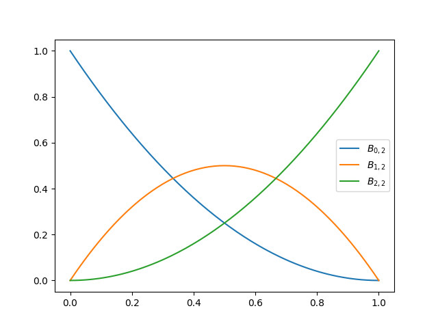
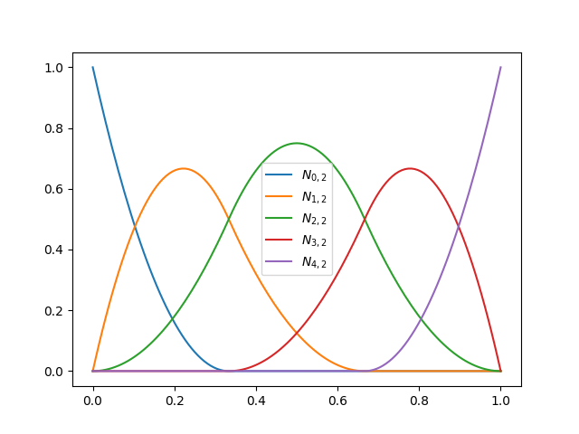
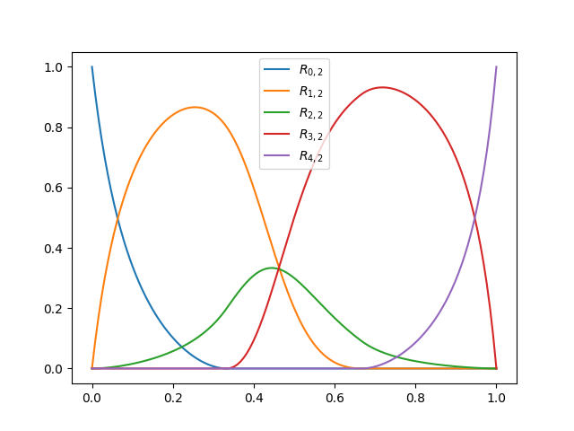

===============
Basis Functions
===============

------
Bezier
------

Bezier curves are the most simple type of NURBS, needing only the degree :math:`p` to define the :math:`(p+1)` basis functions:

.. math::
    B_{i,p}(u) = \binom{p}{i}\left(1-u\right)^{p-i}\cdot u^{i}

At the interval :math:`u \in \left[0, \ 1\right]` and :math:`\forall i=0, \  \cdots,  \ p`

Bezier curves can be described also by Splines, which uses the knotvector :math:`\textbf{U}`

* Degree 1

.. math::
    \mathbf{U} = \left[0, \ 0, \ 1, \ 1\right]

* Degree :math:`p`

.. math::
    \mathbf{U} = \left[\underbrace{0, \ \cdots, \ 0}_{p+1}, \ \underbrace{1, \ \cdots, \ 1}_{p+1}\right]

Use example
-----------

.. code-block:: python

    import numpy as np
    from matplotlib import pyplot as plt
    from compmec.nurbs import GeneratorKnotVector, Function

    degree = 2
    knotvector = GeneratorKnotVector.bezier(degree)
    bezier = Function(knotvector)

    uplot = np.linspace(0, 1, 129)
    for i in range(degree + 1):
        label = r"$B_{%d,%d}$" % (i, degree)
        plt.plot(uplot, bezier[i](uplot), label=label)
    plt.legend()
    plt.show()

Although above the function :math:`B_{i,p}(u)` is described only by :math:`p`, bellow we have the graphs of the basis functions by using the knotvector. They are in **svg** format and therefore you can open and expand to see better the image.

.. dropdown:: Basis functions for degree :math:`p=0`

    .. math::
        \mathbf{U} = \left[0, \ 1\right]

    .. image:: ../img/basis-functions/bezier-basisfunction-p0.svg
        :width: 50 %
        :alt: Basis functions for bezier of degree 0
        :align: center

.. dropdown:: Basis functions for degree :math:`p=1`

    .. math::
        \mathbf{U} = \left[0, \ 0, \ 1, \ 1\right]

    .. image:: ../img/basis-functions/bezier-basisfunction-p1.svg
        :width: 100 %
        :alt: Basis functions for bezier of degree 1
        :align: center

.. dropdown:: Basis functions for degree :math:`p=2`

    .. math::
        \mathbf{U} = \left[0, \ 0, \ 0, \ 1, \ 1, \ 1\right]

    .. image:: ../img/basis-functions/bezier-basisfunction-p2.svg
        :width: 100 %
        :alt: Basis functions for bezier of degree 2
        :align: center

.. dropdown:: Basis functions for degree :math:`p=3`

    .. math::
        \mathbf{U} = \left[0, \ 0, \ 0, \ 0, \ 1, \ 1, \ 1, \ 1\right]

    .. image:: ../img/basis-functions/bezier-basisfunction-p3.svg
        :width: 100 %
        :alt: Basis functions for bezier of degree 3
        :align: center

.. dropdown:: Basis functions for degree :math:`p=4`

    .. math::
        \mathbf{U} = \left[0, \ 0, \ 0, \ 0, \ 0, \ 1, \ 1, \ 1, \ 1, \ 1\right]

    .. image:: ../img/basis-functions/bezier-basisfunction-p4.svg
        :width: 100 %
        :alt: Basis functions for bezier of degree 4
        :align: center

.. dropdown:: Basis functions for degree :math:`p=5`

    .. math::
        \mathbf{U} = \left[0, \ 0, \ 0, \ 0, \ 0, \ 0, \ 1, \ 1, \ 1, \ 1, \ 1, \ 1\right]

    .. image:: ../img/basis-functions/bezier-basisfunction-p5.svg
        :width: 100 %
        :alt: Basis functions for bezier of degree 5
        :align: center

.. dropdown:: Code to generate all the bezier basis functions

    .. code-block:: python

        import numpy as np
        from matplotlib import pyplot as plt
        from compmec.nurbs import GeneratorKnotVector, Function

        prop_cycle = plt.rcParams['axes.prop_cycle']
        colors = prop_cycle.by_key()['color']
        uplot = np.linspace(0, 1, 1029)
        for degree in range(0, 6):
            knotvector = GeneratorKnotVector.bezier(degree)
            function = Function(knotvector)
            sizex = (degree+1)*3
            sizey = (degree+1)*2
            fig, axs = plt.subplots(degree+1, degree+1, figsize=(sizex,sizey))
            for j in range(0, degree+1):
                allvalues = function[:,j](uplot)
                for i, values in enumerate(allvalues):
                    label = r"$B_{%d,%d}$"%(i,j)
                    color = colors[i]
                    ax = axs if degree == 0 else axs[j][i]
                    ax.plot(uplot, values, label=label, linewidth=3,color=color)
                    ax.set_xlim(-0.1, 1.1)
                    ax.set_ylim(-0.1, 1.1)
                    ax.legend()
                    ax.grid()
            fig.tight_layout()
            plt.savefig("bezier-basisfunction-p%d.svg"%degree)

-----------------------------------------------------------------------

--------
B-Spline
--------

B-Splines uses the knotvector :math:`\mathbf{U}` and is recursevelly defined by

.. math::
    N_{i,0}(u) = \begin{cases}1 \ \ \ \text{if} \  u_{i}  \le u < u_{i+1}  \\ 0 \ \ \ \text{else} \end{cases}

.. math::
    N_{i,j}(u) = \dfrac{u - u_i}{u_{i+j}-u_{i}} \cdot N_{i,j-1}(u) + \dfrac{u_{i+j+1}-u}{u_{i+j+1}-u_{i+1}} \cdot N_{i+1,j-1}(u)
    

Use example
-----------

.. code-block:: python

    import numpy as np
    from matplotlib import pyplot as plt
    from compmec.nurbs import GeneratorKnotVector, Function
    
    degree, npts = 2, 5
    knotvector = GeneratorKnotVector.uniform(degree, npts)
    spline = Function(knotvector)
    
    uplot = np.linspace(0, 1, 129)
    for i in range(npts):
        label = r"$N_{%d,%d}$" % (i, degree)
        plt.plot(uplot, spline[i](uplot), label=label)
    plt.legend()
    plt.show()

.. dropdown:: Basis functions for degree :math:`p=0` and :math:`\text{npts}=6`

    .. math::
        \mathbf{U} = \left(0, \ \dfrac{1}{6}, \ \dfrac{2}{6}, \ \dfrac{3}{6}, \ \dfrac{4}{6}, \ \dfrac{5}{6}, \ 1\right)

    .. image:: ../img/basis-functions/splines-basisfunction-p0n6.svg
        :width: 100 %
        :alt: Basis functions for splines of degree 0
        :align: center

.. dropdown:: Basis functions for degree :math:`p=1` and :math:`\text{npts}=6`

    .. math::
        \mathbf{U} = \left(0, \ 0, \ \dfrac{1}{5}, \ \dfrac{2}{5}, \ \dfrac{3}{5}, \ \dfrac{4}{5}\ 1, \ 1 \right)

    .. image:: ../img/basis-functions/splines-basisfunction-p1n6.svg
        :width: 100 %
        :alt: Basis functions for splines of degree 1
        :align: center

.. dropdown:: Basis functions for degree :math:`p=2` and :math:`\text{npts}=6`

    .. math::
        \mathbf{U} = \left(0, \ 0, \ 0, \ \dfrac{1}{4}, \ \dfrac{2}{4}, \ \dfrac{3}{4}, \ 1, \ 1,  \ 1 \right)

    .. image:: ../img/basis-functions/splines-basisfunction-p2n6.svg
        :width: 100 %
        :alt: Basis functions for splines of degree 2
        :align: center

.. dropdown:: Basis functions for degree :math:`p=3` and :math:`\text{npts}=6`

    .. math::
        \mathbf{U} = \left(0, \ 0, \ 0, \ 0, \ \dfrac{1}{3}, \ \dfrac{2}{3}, \ 1, \ 1,  \ 1, \ 1 \right)

    .. image:: ../img/basis-functions/splines-basisfunction-p3n6.svg
        :width: 100 %
        :alt: Basis functions for splines of degree 3
        :align: center

.. dropdown:: Basis functions for degree :math:`p=4` and :math:`\text{npts}=6`

    .. math::
        \mathbf{U} = \left(0, \ 0, \ 0, \ 0, \ 0, \ \dfrac{1}{2}, \ 1, \ 1, \ 1,  \ 1, \ 1 \right)

    .. image:: ../img/basis-functions/splines-basisfunction-p4n6.svg
        :width: 100 %
        :alt: Basis functions for splines of degree 4
        :align: center

.. dropdown:: Code to generate all the spline basis functions

    .. code-block:: python

        import numpy as np
        from matplotlib import pyplot as plt
        from compmec.nurbs import GeneratorKnotVector, Function

        prop_cycle = plt.rcParams['axes.prop_cycle']
        colors = prop_cycle.by_key()['color']
        uplot = np.linspace(0, 1, 1029)

        nptsmax = 6
        degmax = 4
        for degree in range(0, degmax+1):
            nfigsy = degree+1
            sizex = nptsmax*4
            sizey = nfigsy*3
            fig, axs = plt.subplots(nfigsy, nptsmax, figsize=(sizex,sizey))
            knotvector = GeneratorKnotVector.uniform(degree, nptsmax)
            function = Function(knotvector)
            for j in range(0, degree+1):
                allvalues = function[:,j](uplot)
                for i, values in enumerate(allvalues):
                    label = r"$N_{%d,%d}$"%(i,j)
                    color = colors[i]
                    ax = axs[i] if degree == 0 else axs[j, i]
                    ax.plot(uplot, values, label=label, linewidth=3,color=color)
                    ax.set_xlim(-0.1, 1.1)
                    ax.set_ylim(-0.1, 1.1)
                    ax.legend()
                    ax.grid()
            fig.tight_layout()
            plt.savefig("splines-basisfunction-p%dn%d.svg"%(degree, nptsmax))

-----------------------------------------------------------------------

-----------------
Rational B-Spline
-----------------

Like B-Splines, Rational B-Splines also uses the knotvector :math:`\mathbf{U}`, but along a weight vector :math:`\mathbf{w}`.
It's defined by

.. math::
    R_{i,j}(u) = \dfrac{w_{i} \cdot N_{i,j}(u)}{\sum_{k=0}^{n-1} w_{k} \cdot N_{k,j}(u)}

.. math::
    \mathbf{w} = \left[w_0, \ w_1, \ \cdots, \ w_{n-1}\right]

Use example
-----------

.. code-block:: python

    import numpy as np
    from matplotlib import pyplot as plt
    from compmec.nurbs import GeneratorKnotVector, Function
    
    degree, npts = 2, 5
    knotvector = GeneratorKnotVector.uniform(degree, npts)
    rational = Function(knotvector)
    rational.weights = [1, 2, 0.5, 5, 2]

    uplot = np.linspace(0, 1, 129)
    for i in range(npts):
        label = r"$R_{%d,%d}$" % (i, degree)
        plt.plot(uplot, rational[i](uplot), label=label)
    plt.legend()
    plt.show()

.. dropdown:: Basis functions for degree :math:`p=0` and :math:`\text{npts}=6`

    .. math::
        \mathbf{U} = \left(0, \ \dfrac{1}{6}, \ \dfrac{2}{6}, \ \dfrac{3}{6}, \ \dfrac{4}{6}, \ \dfrac{5}{6}, \ 1\right)
        
    .. math::
        \mathbf{w} = \left(2, 4, 2, 6, 1, 2 \right)

    .. image:: ../img/basis-functions/rational-basisfunction-p0n6.svg
        :width: 100 %
        :alt: Basis functions for rational splines of degree 0
        :align: center

.. dropdown:: Basis functions for degree :math:`p=1` and :math:`\text{npts}=6`

    .. math::
        \mathbf{U} = \left(0, \ 0, \ \dfrac{1}{5}, \ \dfrac{2}{5}, \ \dfrac{3}{5}, \ \dfrac{4}{5}\ 1, \ 1 \right)
        
    .. math::
        \mathbf{w} = \left(2, 4, 2, 6, 1, 2 \right)

    .. image:: ../img/basis-functions/rational-basisfunction-p1n6.svg
        :width: 100 %
        :alt: Basis functions for rational splines of degree 1
        :align: center

.. dropdown:: Basis functions for degree :math:`p=2` and :math:`\text{npts}=6`

    .. math::
        \mathbf{U} = \left(0, \ 0, \ 0, \ \dfrac{1}{4}, \ \dfrac{2}{4}, \ \dfrac{3}{4}, \ 1, \ 1,  \ 1 \right)
        
    .. math::
        \mathbf{w} = \left(2, 4, 2, 6, 1, 2 \right)

    .. image:: ../img/basis-functions/rational-basisfunction-p2n6.svg
        :width: 100 %
        :alt: Basis functions for splines of degree 2
        :align: center

.. dropdown:: Basis functions for degree :math:`p=3` and :math:`\text{npts}=6`

    .. math::
        \mathbf{U} = \left(0, \ 0, \ 0, \ 0, \ \dfrac{1}{3}, \ \dfrac{2}{3}, \ 1, \ 1,  \ 1, \ 1 \right)

    .. math::
        \mathbf{w} = \left(2, 4, 2, 6, 1, 2 \right)

    .. image:: ../img/basis-functions/rational-basisfunction-p3n6.svg
        :width: 100 %
        :alt: Basis functions for rational splines of degree 3
        :align: center

.. dropdown:: Basis functions for degree :math:`p=4` and :math:`\text{npts}=6`

    .. math::
        \mathbf{U} = \left(0, \ 0, \ 0, \ 0, \ 0, \ \dfrac{1}{2}, \ 1, \ 1, \ 1,  \ 1, \ 1 \right)

    .. math::
        \mathbf{w} = \left(2, 4, 2, 6, 1, 2 \right)

    .. image:: ../img/basis-functions/rational-basisfunction-p4n6.svg
        :width: 100 %
        :alt: Basis functions for rational splines of degree 4
        :align: center

.. dropdown:: Code to generate all the rational spline basis functions

    .. code-block:: python

        import numpy as np
        from matplotlib import pyplot as plt
        from compmec.nurbs import GeneratorKnotVector, Function

        prop_cycle = plt.rcParams['axes.prop_cycle']
        colors = prop_cycle.by_key()['color']
        uplot = np.linspace(0, 1, 1029)

        nptsmax = 6
        degmax = 4
        for degree in range(0, degmax+1):
            nfigsy = degree+1
            sizex = nptsmax*4
            sizey = nfigsy*3
            fig, axs = plt.subplots(nfigsy, nptsmax, figsize=(sizex,sizey))
            knotvector = GeneratorKnotVector.uniform(degree, nptsmax)
            function = Function(knotvector)
            function.weights = [1, 2, 1, 3, 0.5, 1]
            for j in range(0, degree+1):
                allvalues = function[:,j](uplot)
                for i, values in enumerate(allvalues):
                    label = r"$R_{%d,%d}$"%(i,j)
                    color = colors[i]
                    ax = axs[i] if degree == 0 else axs[j, i]
                    ax.plot(uplot, values, label=label, linewidth=3,color=color)
                    ax.set_xlim(-0.1, 1.1)
                    ax.set_ylim(-0.1, 1.1)
                    ax.legend()
                    ax.grid()
            fig.tight_layout()
            plt.savefig("rational-basisfunction-p%dn%d.svg"%(degree, nptsmax))
