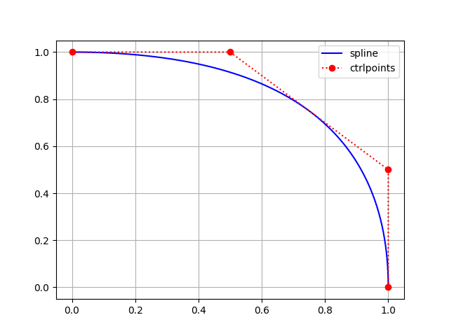

.. _custom-objects:

==============
Custom objects
==============

The main motivation of this package is the use of custom objects.

-------------
First example
-------------

For example, you can use fractional knots and ctrlpoints to get a fractional point at evaluation:

.. code-block:: python

    import numpy as np
    from fractions import Fraction
    from compmec.nurbs import Curve

    zero, half, one = Fraction(0), Fraction(1, 2), Fraction(1)
    knotvector = [zero, zero, zero, half, one, one, one]
    ctrlpoints = [(one, zero), (one, half), (half, one), (zero, one)]
    ctrlpoints = np.array(ctrlpoints)
    curve = Curve(knotvector, ctrlpoints)

    print(curve(zero))  # [Fraction(1, 1) Fraction(0, 1)]
    print(curve(half))  # [Fraction(3, 4) Fraction(3, 4)]
    print(curve(one))  # [Fraction(0, 1) Fraction(1, 1)]
    print(curve(0.0))  # [1.0  0.0]
    print(curve(0.5))  # [0.75 0.75]
    print(curve(1.0))  # [0.0  1.0]

--------------
Second example
--------------

You can also define a custom point, for example ``Point2D`` defined bellow:

.. code-block:: python

    from __future__ import annotations
    from compmec.nurbs import Curve

    class Point2D:

        def __init__(self, x: float, y: float):
            self.x = x
            self.y = y

        def __add__(self, point: Point2D) -> Point2D:
            return Point2D(self.x + point.x, self.y + point.y)
        
        def __rmul__(self, number: float) -> Point2D:
            return Point2D(number * self.x, number * self.y)
        
        def __getitem__(self, index):
            return self.x if index == 0 else self.y
        
        def __str__(self) -> str:
            return "pt(%s, %s)" % (str(self.x), str(self.y))

    knotvector = [0, 0, 0, 1/2, 1, 1, 1]
    ctrlpoints = [(1, 0), (1, 1/2), (1/2, 1), (0, 1)]
    ctrlpoints = [Point2D(x, y) for x, y in ctrlpoints]
    curve = Curve(knotvector, ctrlpoints)

    print(curve(0.0))  # pt(1.0, 0.0)
    print(curve(0.5))  # pt(0.75, 0.75)
    print(curve(1.0))  # pt(0.0, 1.0)

.. note::
    I tried to keep the requirements of custom point at minimum. As example, ``nurbs`` package doesn't require ``Point2D`` to have many methods (like ``__sub__`` or ``__eq__``) to work, only the mandatory methods ``__add__`` (add two points), ``__rmul__`` (multiply by scalar) and ``__getitem__`` (get coordinates, to compute the norm).

-------------
Third example
-------------

You can also use third party packages, for example, ``clifford`` supports the sum of two objects and multiplication by a scalar:

.. code-block:: python

    from clifford.g2 import e1, e2, e12
    from compmec.nurbs import Curve 

    # Define knot vector
    knotvector = [0, 0, 0, 1, 2, 2, 2]

    # Use clifford objects as control points
    ctrlpoints = [1 + 2*e1 - 1*e2 - 3*e12,
                  0 - 3*e1 + 1*e2 + 2*e12,
                  2 + 4*e1 - 3*e2 + 3*e12,
                  5 - 1*e1 + 1*e2 - 4*e12]

    # Create curve
    curve = Curve(knotvector, ctrlpoints)

    # Evaluate points
    print(curve(0))    # 1.0 + (2.0^e1) - (1.0^e2) - (3.0^e12)
    print(curve(0.5))  # 0.5 - (0.875^e1) + (0.875^e12)
    print(curve(1))    # 1.0 + (0.5^e1) - (1.0^e2) + (2.5^e12)
    print(curve(1.5))  # 2.5 + (1.875^e1) - (1.5^e2) + (1.125^e12)
    print(curve(2))    # 5.0 - (1.0^e1) + (1.0^e2) - (4.0^e12)

--------------
Fourth example
--------------

If you want to increase the float precision, you can use the library ``mpmath``

.. code-block:: python

    import mpmath
    from compmec.nurbs import Curve 

    mpmath.mp.dps = 50  # Set precision to 50 digits

    # Define knot vector
    zero, half, one = mpmath.mpf(0), mpmath.mpf(1)/2, mpmath.mpf(1)
    knotvector = [zero, zero, zero, half, one, one, one]

    # Define the control points
    ctrlpoints = [(one, zero), (one, half), (half, one), (zero, one)]
    ctrlpoints = [mpmath.matrix(point) for point in ctrlpoints]

    # Create curve
    curve = Curve(knotvector, ctrlpoints)

    # Evaluate points
    print(curve(0))    # [mpf('1.0') mpf('0.0')]
    print(curve(0.5))  # [mpf('0.75') mpf('0.75')]
    print(curve(1))    # [mpf('0.0') mpf('1.0')]